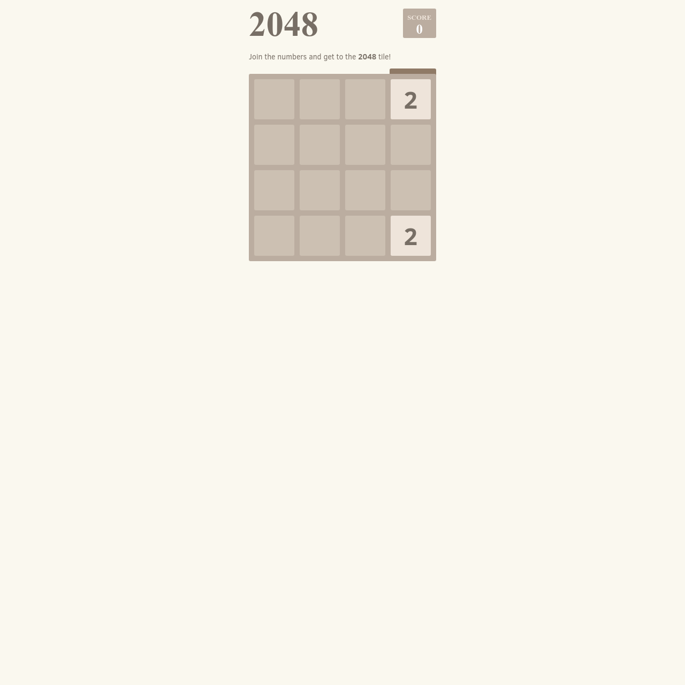

# 2048 Clone

This project is a clone of the popular 2048 game, where players combine numbered tiles by swiping in four directions to reach the target value of 2048. The project utilizes HTML, CSS, and JavaScript to replicate the classic game mechanics and provide an engaging user experience.

## Features
- **Playable Game Board**: A 4x4 grid where users can combine tiles of the same value by swiping up, down, left, or right.
- **Score Tracking**: Displays the current score and updates dynamically as tiles are merged.
- **Responsive Design**: Adaptable layout that works across various devices and screen sizes.
- **Keyboard and Touch Controls**: Supports both keyboard arrow keys and touch gestures for controlling tile movement.
- **Restart Game**: Includes a "New Game" button that resets the board and score to start over.

## Files
- **index.html**: Contains the HTML structure of the game, including the main container for the game board and the score display.
- **style.css**: Provides the styling for the game board, tiles, and user interface elements, ensuring a visually appealing and consistent look.
- **index.js**: Implements the game logic, including tile creation, movement, merging, score calculation, and handling user inputs.

## Technologies Used
- **HTML5**: For the structure and layout of the game.
- **CSS3**: To style the board, tiles, and interface elements for a polished visual presentation.
- **JavaScript (with jQuery)**: To handle game mechanics, including the movement and merging of tiles, score updates, and user interactions.

## Files
- **Best on Desktop**: For the optimal gaming experience, it is recommended to play this game on a desktop device.

## Screenshot

## License
This project is open-source and available under the MIT License.

